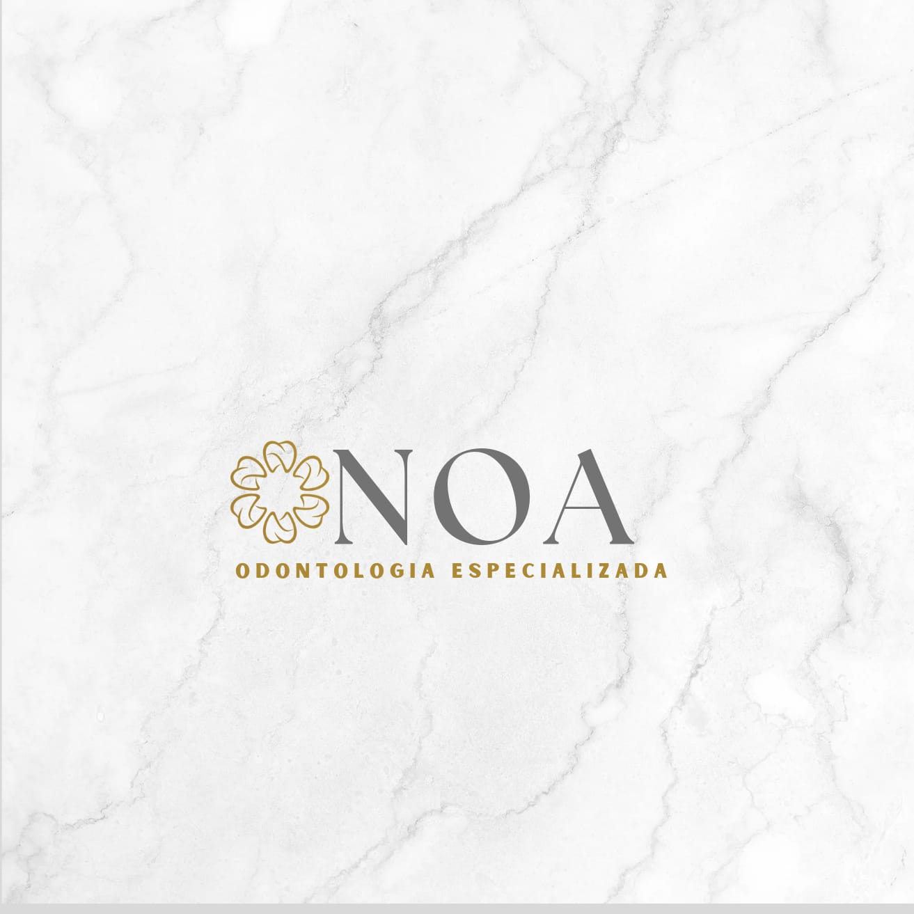

# Link Tree

## Descrição
Este projeto é um **mini site de links**, desenvolvido para centralizar os principais contatos e informações da clínica em um único lugar.  
O site é simples, responsivo e pode ser acessado em dispositivos móveis e desktops.

--- 

## Funcionalidades

- Exibe o **logo da clínica**;
- Mostra o **nome e slogan** da clínica;
- Botões de acesso rápido para:
  - WhatsApp para agendamento de consultas;
  - Instagram da clínica;
  - Localização no Google Maps;
- Design **escuro e moderno** com botões claros para destaque.

---

## Código Principal

```html
<!DOCTYPE html>
<html lang="pt-br">
<head>
  <meta charset="UTF-8">
  <meta name="viewport" content="width=device-width, initial-scale=1.0">
  <title>NOA Odontologia - Links</title>
  <style>
    body {
      background-color: #1f1f1f;
      font-family: Arial, sans-serif;
      color: white;
      text-align: center;
      padding: 30px;
    }
    .logo {
      width: 120px;
      border-radius: 50%;
      margin-bottom: 20px;
    }
    h1 {
      font-size: 24px;
      margin: 10px 0;
    }
    p {
      color: #ccc;
      margin-bottom: 30px;
    }
    .link-btn {
      display: block;
      background-color: white;
      color: #1f1f1f;
      padding: 15px;
      margin: 10px auto;
      width: 80%;
      max-width: 400px;
      border-radius: 10px;
      text-decoration: none;
      font-weight: bold;
    }
    .link-btn:hover {
      background-color: #e2e2e2;
    }
  </style>
</head>
<body>
  
  <h1>NOA Odontologia</h1>
  <p>Seu sorriso cuidado com excelência!</p>

  <a href="https://api.whatsapp.com/send?phone=5583981825528&text=Oi,%20vim%20pelo%20o%20instagram.%20Gostaria%20de%20agendar%20uma%20consulta%20de%20avalia%C3%A7%C3%A3o!" class="link-btn">📞 Marque sua Consulta!</a>
  <a href="https://www.instagram.com/noaodontologiajp" class="link-btn">📸 Instagram</a>
  <a href="https://maps.app.goo.gl/tEDJdoh9Pm8J4Y3V6" class="link-btn">📍 Nossa Localização</a>
</body>
</html>
```

---

## Requisitos

- Navegador moderno (Chrome, Edge, Firefox, Safari);
- Conexão com a internet para abrir links externos;
- Arquivo `logoNoa.jpeg` no mesmo diretório do HTML.

---

## Execução

1. Baixe os arquivos do projeto;
2. Abra o arquivo `index.html` em seu navegador;
3. Clique nos botões para acessar os contatos e redes da clínica.

---

## Exemplo de Uso

- Clicar em **📞 Marque sua Consulta!** abre o WhatsApp com mensagem pronta para agendamento;
- Clicar em **📸 Instagram** direciona para o perfil da clínica;
- Clicar em **📍 Nossa Localização** abre o Google Maps com o endereço da clínica.

---

## Contribuição

- Atualização de links;
- Alteração de design ou cores;
- Inclusão de novas redes sociais ou contatos;
- Melhorias na responsividade e experiência do usuário.

---

## Licença

Uso pessoal e comercial da clínica NOA Odontologia.
